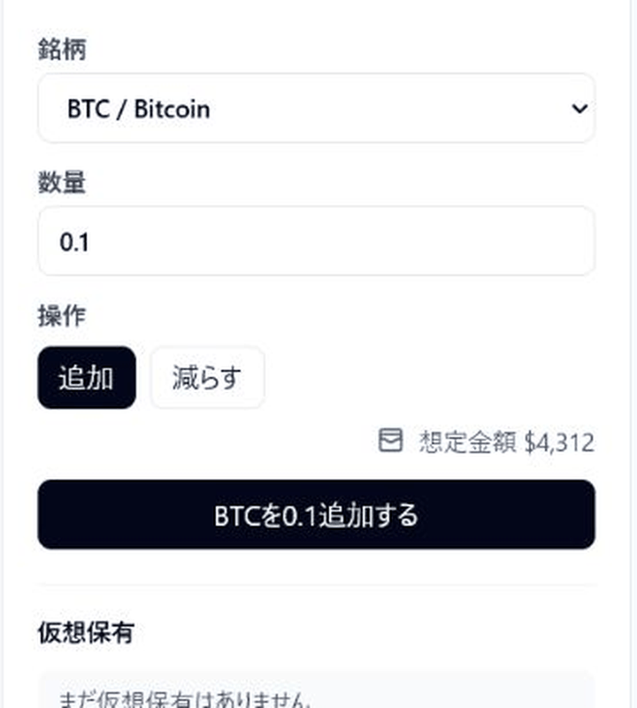

# Crypto Real-time Dashboard

[](https://github.com/proto-atlas/crypto-realtime-dashboard/actions/workflows/ci.yml)

Crypto Real-time Dashboardは、暗号資産の公開マーケットデータを題材にしたリアルタイムダッシュボードです。デモモード、REST連携、WebSocket連携を切り替えながら、価格更新、ローソク足チャート、10万件の仮想取引履歴、仮想ポートフォリオを確認できます。

実取引、送金、ウォレット接続、投資助言は扱いません。初期表示は外部APIを呼ばないデモモードです。REST連携 / WebSocket連携を選んだ場合だけ、BFF Worker経由でCoinGecko、Binance、Coinbaseの公開マーケットデータへ接続します。API keyはBFF側だけで扱い、ブラウザへ渡しません。

## 公開URL

- 公開URL: https://crypto-realtime-dashboard.pages.dev
- GitHub: https://github.com/proto-atlas/crypto-realtime-dashboard
- BFF Worker: https://crypto-realtime-dashboard-bff.atlas-lab.workers.dev

## 主な流れ

- デモモードで、外部APIを呼ばずにダッシュボードを表示する。
- Market Watchで価格、変化率、出来高、接続状態を確認する。
- REST連携で、BFF Worker経由のREST API取得に切り替える。
- WebSocket連携で、WebSocket中継による価格更新に切り替える。
- BinanceのWebSocket接続が閉じた場合は、CoinbaseのWebSocket中継へ切り替える。
- 取引履歴ラボで、10万件の仮想取引履歴を検索、フィルタ、ソート、仮想スクロールで確認する。
- 仮想ポートフォリオで、仮想ポジション、評価額、含み損益を確認する。

## 用語

- デモモード: 外部APIを呼ばず、ブラウザ内で生成した固定データで主要画面を確認するモード。
- REST連携: BFF Worker経由でREST APIから価格データを取得するモード。
- WebSocket連携: BFF WorkerのWebSocket中継を通して価格更新を受け取るモード。
- BFF Worker: API keyをブラウザに出さず、外部APIとのやり取りを受け持つCloudflare Worker。
- 自動切り替え: BinanceのWebSocketが閉じた場合やエラーになった場合に、Coinbaseへ接続先を切り替える動作。
- 仮想ポートフォリオ: 実取引ではなく、ブラウザ内に保存するデモ用の保有情報。

## 確認方法

30秒で見る場合は、公開URLを開き、デモモードのMarket Watch、ローソク足チャート、取引履歴ラボ、仮想ポートフォリオを確認できます。

もう少し詳しく見る場合は、REST連携 / WebSocket連携に切り替えると、BFF Worker経由の公開マーケットデータ取得とWebSocket中継を確認できます。外部接続を使う動作は外部APIやネットワーク状態の影響を受けるため、長時間稼働やSLAは主張しません。

設計と検証の詳細は、[アーキテクチャ概要](docs/architecture.md)、[設計判断](docs/design-decisions.md)、[検証記録の一覧](docs/evidence/INDEX.md) にまとめています。

## 画面



このGIFは、UIの操作導線を短く見せるための紹介素材です。外部APIの長時間稼働、Rate Limitingの429発火、投資判断の有効性を証明するものではありません。


## ドキュメント

- [アーキテクチャ概要](docs/architecture.md): Pages、Workers BFF、KV、Durable Objects、外部APIとのデータフロー
- [設計判断](docs/design-decisions.md): デモモード、BFF Worker、WebSocket自動切り替え、仮想ポートフォリオ、テスト方針
- [検証記録の一覧](docs/evidence/INDEX.md): CI、Playwright E2E、本番URL確認、WebSocket自動切り替えの確認記録
- [信頼性改善ログ](docs/reliability-log.md): WebSocket自動切り替えまわりの改善履歴

## 検証記録

主な検証記録は [docs/evidence/INDEX.md](docs/evidence/INDEX.md) から確認できます。

- `pnpm check`: lint、typecheck、test、buildが成功
- Vitest: shared-types、BFF、Webの単体・統合テストが成功
- Playwright E2E: デモモード中心の7テストが成功
- 本番URL確認: REST連携、WebSocket連携、仮想ポートフォリオのポジション更新とリロード後復元を確認
- WebSocket自動切り替え: Binance疑似失敗時にCoinbaseへ切り替わることをPlaywright E2Eで確認
- Lighthouse: 2026-05-07時点の手元計測を参考値として確認

各検証は、その時点の構成と対象データに対する結果です。外部API、WebSocket中継、Cloudflare runtimeの継続稼働を保証するものではありません。

## ローカル実行

```bash
pnpm install
pnpm dev
pnpm check
```

`COINGECKO_API_KEY` はBFF側だけで使う値です。ブラウザへ直接渡しません。ローカルでREST連携やWebSocket中継を確認する場合は、`apps/bff/.dev.vars.example` を参考に `apps/bff/.dev.vars` を作成します。`.dev.vars` はgit管理しません。

## 技術スタック

- React 19
- Vite
- TypeScript
- Tailwind CSS v4
- TanStack Router / Query / Table / Virtual
- Lightweight Charts
- Zustand
- Hono
- Cloudflare Pages / Workers / Workers KV / Durable Objects
- Vitest
- Playwright
- Biome

## 現在入れていないもの

- 実取引、送金、ウォレット接続、取引所アカウント連携
- 投資助言、売買推奨、収益性の主張
- ユーザーアカウント、ログイン、サーバー側のポートフォリオ保存
- 価格アラート、通知、バックグラウンド監視
- 本番認証、ユーザー別quota、厳密なIP単位の呼び出し制限
- WebSocket接続の長時間稼働保証
- 取引履歴ラボの列幅リサイズのキーボード操作
- スクリーンリーダー実機確認
- mobile実機での長時間操作確認

## ライセンス

MIT License。詳細は [LICENSE](LICENSE) を参照してください。
