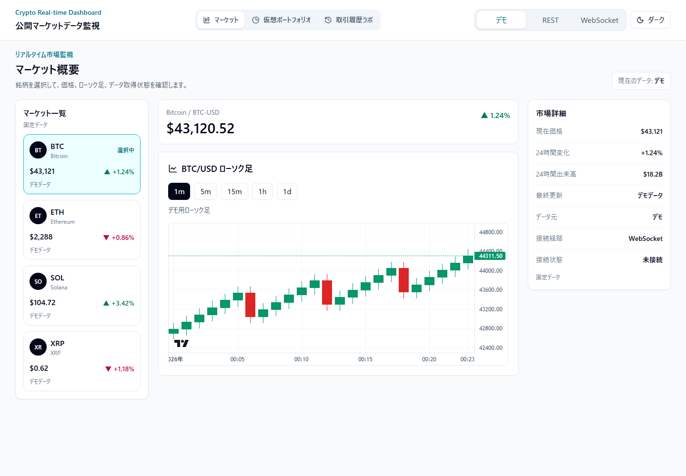
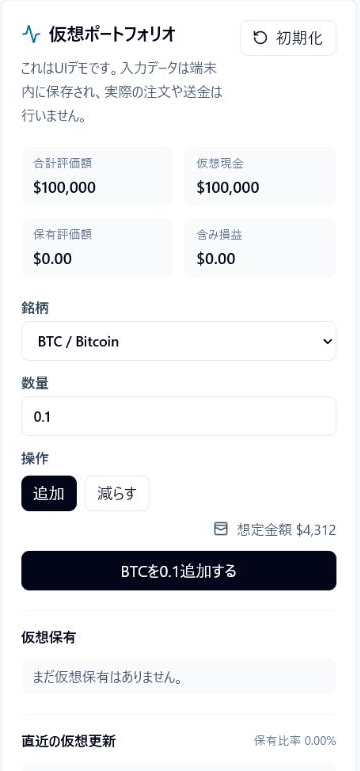
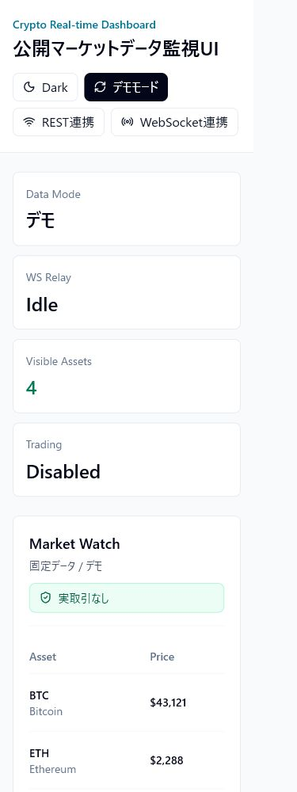

# Crypto Real-time Dashboard

[](https://github.com/proto-atlas/crypto-realtime-dashboard/actions/workflows/ci.yml)
[](https://github.com/proto-atlas/crypto-realtime-dashboard/actions/workflows/production-smoke.yml)

Crypto Real-time Dashboardは、暗号資産の公開マーケットデータを題材にしたリアルタイムダッシュボードです。デモモード、REST連携、WebSocket連携を切り替えながら、価格更新、ローソク足チャート、10万件の仮想取引履歴、仮想ポートフォリオを確認できます。

実取引、送金、ウォレット接続、投資助言は扱いません。初期表示は外部APIを呼ばないデモモードです。REST連携またはWebSocket連携を選んだ場合だけ、BFF Worker経由でCoinGecko、Binance、Coinbaseの公開マーケットデータへ接続します。APIキーはBFF側だけで扱い、ブラウザへ渡しません。

## 公開URL

- 公開URL: https://crypto-realtime-dashboard.pages.dev
- GitHub: https://github.com/proto-atlas/crypto-realtime-dashboard

## 短時間確認ガイド

30秒で見る場合は、公開URLを開き、マーケット画面で銘柄を切り替えてローソク足チャートを確認してください。次に下部ナビゲーションまたは上部ナビゲーションから、仮想ポートフォリオと取引履歴ラボへ移動できます。初期表示では外部APIを呼びません。

REST連携やWebSocket連携を選ぶと、BFF Worker経由でCoinGecko、Binance、Coinbaseの公開マーケットデータへ接続します。外部APIやWebSocketは提供元とネットワーク状態に依存するため、長時間稼働やSLAは主張しません。

実装を見る場合は、まず [アーキテクチャ概要](docs/architecture.md)、[設計判断](docs/design-decisions.md)、[検証記録の一覧](docs/evidence/INDEX.md) を見てください。BFF Worker、Workers KV、Durable Objects、WebSocketの自動切り替え、10万件テーブルの扱いを追えます。

## 主な流れ

- デモモードで、外部APIを呼ばずに3つの画面を表示する。
- マーケット画面でBTC、ETH、SOL、XRPを選び、価格、変化率、出来高、データ鮮度、接続状態を確認する。
- REST連携で、BFF Worker経由のREST API取得に切り替える。
- WebSocket連携で、WebSocket中継による価格更新に切り替える。
- WebSocket連携はCoinbaseを主経路とし、接続できない場合はBinanceへ切り替える。
- Binanceへ切り替えた後は30秒ごとにCoinbaseを再確認し、有効な価格更新を受信してから主経路へ戻す。
- 取引履歴ラボで、10万件の仮想取引履歴を検索、絞り込み、並べ替え、仮想スクロールで確認する。
- 仮想ポートフォリオで、仮想ポジション、評価額、含み損益を確認する。

## 用語

- デモモード: 外部APIを呼ばず、ブラウザ内で生成した固定データで主要画面を確認するモード。
- REST連携: BFF Worker経由でREST APIから価格データを取得するモード。
- WebSocket連携: BFF WorkerのWebSocket中継を通して価格更新を受け取るモード。
- BFF Worker: APIキーをブラウザに出さず、外部APIとのやり取りを受け持つCloudflare Worker。
- 自動切り替え: CoinbaseのWebSocketが閉じた場合やエラーになった場合にBinanceへ切り替え、有効なCoinbase価格を再受信した後に主経路へ戻す動作。
- 仮想ポートフォリオ: 実取引ではなく、ブラウザ内に保存するデモ用の保有情報。

## 画面

- `/market`：マーケット一覧、選択銘柄の価格、ローソク足チャート、市場詳細を表示します。選択銘柄と時間足はURLへ保存されます。
- `/portfolio`：仮想保有の追加と減少、評価額、含み損益を表示します。
- `/history`：10万件の仮想取引履歴を検索、絞り込み、並べ替え、仮想スクロールで表示します。

デスクトップではマーケット一覧、チャート、市場詳細を3列で表示します。モバイルではチャートを先に表示し、マーケット一覧を横スクロール、主要画面の移動を下部ナビゲーションで行います。







## ドキュメント

- [アーキテクチャ概要](docs/architecture.md): Pages、Workers BFF、KV、Durable Objects、外部APIとのデータフロー
- [設計判断](docs/design-decisions.md): デモモード、BFF Worker、WebSocket自動切り替え、仮想ポートフォリオ、テスト方針
- [検証記録の一覧](docs/evidence/INDEX.md): CI、Playwright E2E、公開環境確認、WebSocket自動切り替えの確認記録
- [現在のWebSocket経路の確認記録](docs/evidence/websocket-primary-fallback-2026-07-15.md): Coinbase主経路、Binance予備経路、Coinbase復旧時の切り戻し
- [信頼性改善ログ](docs/reliability-log.md): WebSocket自動切り替えまわりの改善履歴

## 検証記録

主な検証記録は [docs/evidence/INDEX.md](docs/evidence/INDEX.md) から確認できます。

- `pnpm check`: Biome、typecheck、検証スクリプトとVitestの計216件、buildが成功
- Playwright E2E: 3画面の移動、銘柄のクリック・キーボード操作、ローソク足canvas、仮想ポートフォリオ、10万件テーブル、Coinbase疑似失敗時のBinance切り替え、375px・390px・768px表示を含む15件が成功
- 公開環境E2E: 仮想ポートフォリオのクリック・Enter・減少・再読み込み保持、操作状態、390px表示を含む5件が成功
- 公開環境API確認: トップ画面がHTTP 200を返し、Coinbaseローソク足の`1m`、`5m`、`15m`、`1h`、`1d`で各120本のOHLCVと時刻間隔を確認
- Lighthouse: 2026-05-07時点の手元計測を参考値として確認

各検証は、その時点の構成と対象データに対する結果です。外部API、WebSocket中継、Cloudflare実行環境の継続稼働を保証するものではありません。

## ローカル実行

```bash
pnpm install
pnpm dev
pnpm check
```

`COINGECKO_API_KEY`はBFF側だけで使う値です。ブラウザへ直接渡しません。ローカルでREST連携やWebSocket中継を確認する場合は、`apps/bff/.dev.vars.example`を参考に`apps/bff/.dev.vars`を作成します。`.dev.vars`はGit管理しません。

## CI/CD

`main`へのpushでは、GitHub Actionsがlint、typecheck、test、build、Playwright E2Eを実行します。すべて成功した場合だけ、同じcommitのBFF WorkerとWebをCloudflare WorkersとPagesへ反映します。

同じブランチで新しい実行が始まった場合は古い実行を中止し、古いcommitが後から公開先を上書きしないようにしています。公開環境確認は手動実行と日次実行に対応し、トップ画面、Coinbaseローソク足5種類、CoinbaseとBinanceのWebSocket初回データ受信、公開UIの主要操作を確認します。

## 技術スタック

- React 19
- Vite
- TypeScript
- Tailwind CSS v4
- TanStack Router、TanStack Query、TanStack Table、TanStack Virtual
- Lightweight Charts
- Zustand
- Hono
- Cloudflare Pages、Workers、Workers KV、Durable Objects
- Vitest
- Playwright
- Biome

## 現在入れていないもの

- 実取引、送金、ウォレット接続、取引所アカウント連携
- 投資助言、売買推奨、収益性の主張
- ユーザーアカウント、ログイン、サーバー側のポートフォリオ保存
- 価格アラート、通知、バックグラウンド監視
- 本番認証、ユーザー別上限、厳密なIP単位の呼び出し制限
- WebSocket接続の長時間稼働保証
- 取引履歴ラボの列幅リサイズのキーボード操作
- スクリーンリーダー実機確認
- モバイル実機での長時間操作確認

## ライセンス

MIT License。詳細は [LICENSE](LICENSE) を参照してください。
